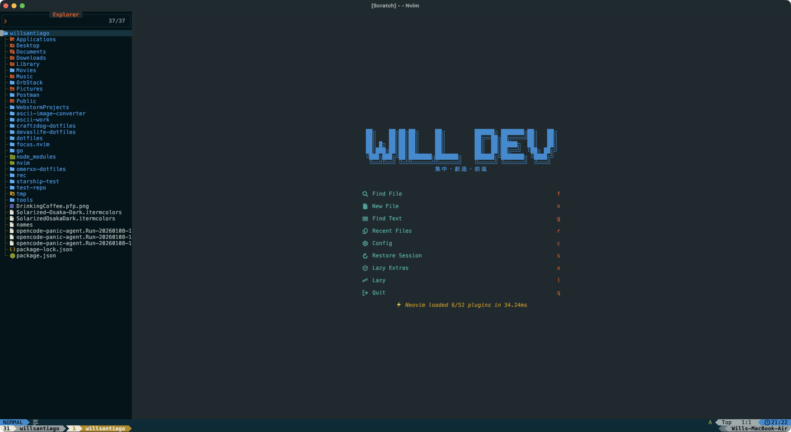
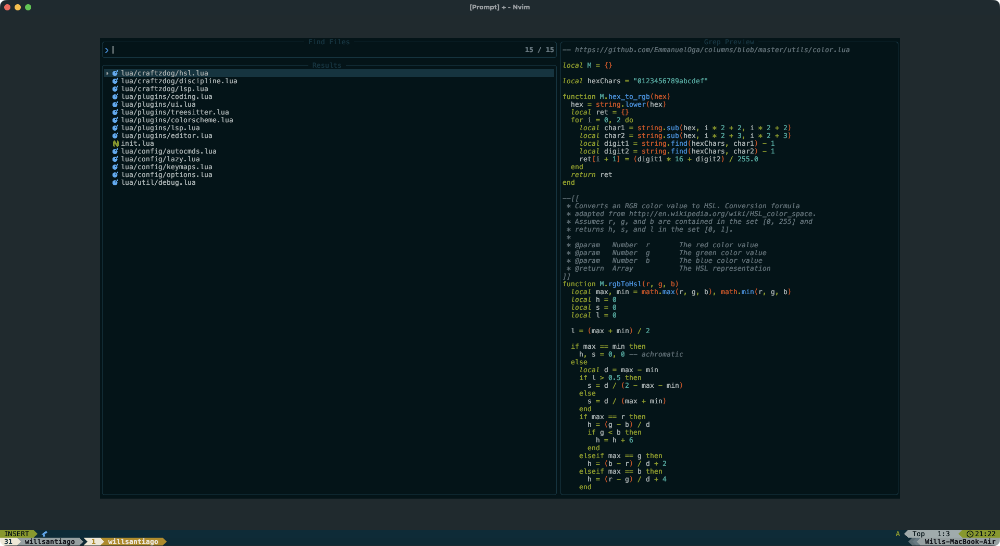
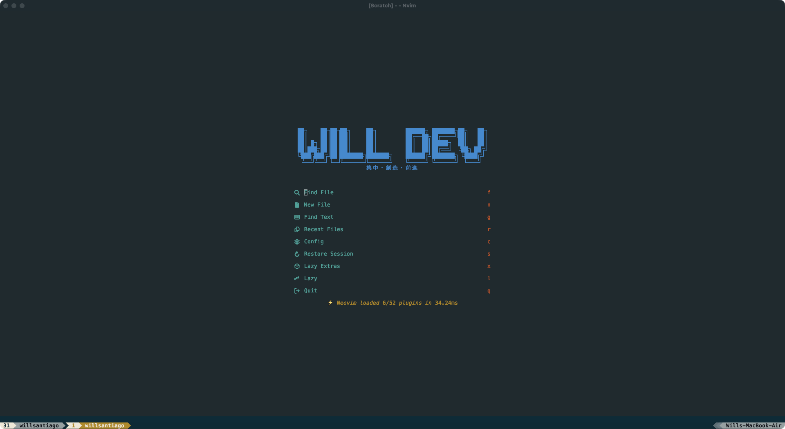

# 🚀 My Dotfiles

Personal configuration files for my development environment.

## 📸 Screenshots

<div align="center">
  <table>
    <tr>
      <td align="center">
        
        <br/>
        <em>Neovim Dashboard</em>
      </td>
    </tr>
    <tr>
      <td align="center">
        
        <br/>
        <em>Coding Environment</em>
      </td>
    </tr>
    <tr>
      <td align="center">
        
        <br/>
        <em>Plugin Manager</em>
      </td>
    </tr>
  </table>
</div>

## 📦 What's Inside

### Neovim Configuration

This repository contains my Neovim setup powered by [LazyVim](https://www.lazyvim.org/), a Neovim configuration framework built on top of lazy.nvim.

```
nvim/
├── init.lua           # Main Neovim configuration entry point
├── lazy-lock.json     # Plugin version lock file
├── lazyvim.json       # LazyVim configuration
└── lua/               # Lua configuration modules
```

## 🛠️ Prerequisites

- [Neovim](https://neovim.io/) >= 0.9.0
- Git
- A [Nerd Font](https://www.nerdfonts.com/) (optional, for icons)
- [ripgrep](https://github.com/BurntSushi/ripgrep) (for telescope live grep)
- A C compiler (for treesitter)

## 📥 Installation

### Neovim Configuration

1. **Backup your existing Neovim configuration** (if any):
   ```bash
   mv ~/.config/nvim ~/.config/nvim.backup
   mv ~/.local/share/nvim ~/.local/share/nvim.backup
   mv ~/.local/state/nvim ~/.local/state/nvim.backup
   mv ~/.cache/nvim ~/.cache/nvim.backup
   ```

2. **Clone this repository**:
   ```bash
   git clone https://github.com/willsantiagomedina/dotfiles.git ~/.dotfiles
   ```

3. **Symlink the Neovim configuration**:
   ```bash
   ln -s ~/.dotfiles/nvim ~/.config/nvim
   ```

4. **Launch Neovim**:
   ```bash
   nvim
   ```
   
   LazyVim will automatically install all plugins on the first run.

## 🎨 Features

- 🔌 Plugin management with [lazy.nvim](https://github.com/folke/lazy.nvim)
- 🎯 Pre-configured LazyVim setup with sensible defaults
- 📝 Enhanced editing experience with modern Neovim plugins
- 🔍 Fuzzy finding and navigation
- 🌳 File explorer and git integration
- 🎨 Beautiful UI with modern themes
- 🖼️ Custom dashboard with personalized branding

## 🔧 Customization

Custom configurations and plugin overrides can be found in the `lua/` directory. LazyVim makes it easy to:

- Add new plugins in `lua/plugins/`
- Override default settings in `lua/config/`
- Create custom keymaps and options

Check out the [LazyVim documentation](https://www.lazyvim.org/) for more information on customization.

## 📚 Useful Commands

### Plugin Management
- `:Lazy` - Open the lazy.nvim plugin manager UI
- `:Lazy sync` - Update all plugins
- `:Lazy clean` - Remove unused plugins

### LazyVim Extras
- `:LazyExtras` - Browse and install LazyVim plugin extras

## 🤝 Contributing

Feel free to fork this repository and customize it to your needs!

## 📝 License

These are my personal dotfiles. Feel free to use them as inspiration for your own configuration!

## 🔗 Resources

- [LazyVim Documentation](https://www.lazyvim.org/)
- [Neovim Documentation](https://neovim.io/doc/)
- [lazy.nvim](https://github.com/folke/lazy.nvim)

---

**Note**: This configuration is tailored to my personal workflow. You may need to adjust settings to match your preferences.
